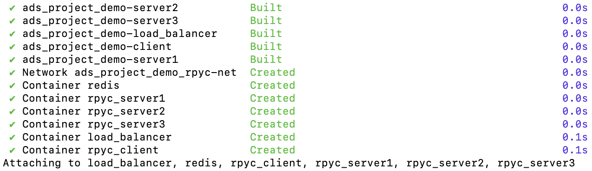

### Functional
- When a client sends a `(keyword, text_reference)` request, the server returns the exact number of occurrences of that keyword in the referenced text.
- The server caches answers in a Redis database so identical future requests are served from cache and supports queries such as "most frequently requested keywords."

### Non-functional:
- For every request the client measures and records execution latency (time from sending the request to receiving the response) in ms.
- The service must be scalable to multiple server managed by a load balancer and continue serving requests when a server fails (it must support fault detection and rerouting by the balancer).

### Stakeholders:
- Clients / client applications: Submit `(keyword, text_reference)` requests and receive word counts.
- Developers: Design, implement with Python and Redis, deploy with Docker, and test the client-server system, measure performance, and document results for evaluation.

### Usage
- Start the server: `docker-compose up -d --build`

- Start the client: 
    - `docker exec -it rpyc_client bash`
    - `python client.py`

- Checkout logs for load balancer: `docker logs -f load_balancer`

- Shutdown the server and clean redis cache: `docker-compose down -v`
